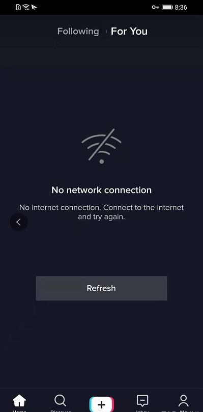

# 国际版TikTok安卓手机怎么用？

在国内大家都知道抖音，其实Tik Tok就是抖音，两个软件作用 功能等都是一样的，字节跳动把抖音和TikTok区分开了，两者可以说是两个互不相通的app。拒绝了国内玩家入场，所以这也就是大陆用户为什么不能通过正常渠道渠道下载和浏览TikTok上面的视频。

很多人因为不正确的下载方式就会出现：黑屏 0播放 打不开等情况

所以我们要解决核心问题：要让TikTok检测不出我们属于大陆用户，而是正常的海外用户，只要达到这一点基本上就可以正常操作了。

整体流程

安卓手机下载Tiktok软件的流程：

# (一)购买专门的工作机：

如果我们想用安卓手机运营Tiktok软件，需要购买专门的工作手机。

在国内的二手平台上购买即可，价位一般在几百元左右。

手机配置方面的最低要求是：内存3+32G以上，系统7.0以上。

首选的安卓机类型是海外版的手机，如谷歌手机(如谷歌 Pixel2)、三星手机(如美版三星S7/S8)等。

当然，国产安卓手机也是可以的，只是从账号安全性的角度，不如海外版的好(我们都测试过国内的所有型号手机)

华为手机由于与谷歌框架存在兼容性问题，因此不建议使用。

# (二)拔掉安卓手机sim卡/使用国外卡：

只要通过国内通信运营商连接网络，就会被识别，容易出现黑屏。外国的手机卡是可以使用的，但是现阶段对于我们做Tiktok账号而言。使用外国手机卡的运营成本会高一些，没有必要。
**我们并不需要能正常的外国手机卡，放一张废卡就可以 ，如果您做英国的，那么您就放一张英国SIM卡的，如果是做美国的，就放一张美国的SIM废卡**

**需要购买外国废卡，可以找我的qq 1684583456**

(三)恢复出厂设置：

这个很关键，在国内使用过的都有残余数据的遗留，一定要重置手机，同时关闭定位

科学上网：

可自行搜索科学上网工具，在按照教程操作完成之后，就可下载谷歌三件套，分别是：分别是Google Play Store谷款应用商店;Google Play Service谷歌应用账号认证;Google Service Framework谷歌服务框架方法，全部安装成功之后，才能够进行下一步。

(五)关掉手机定位/设置虚拟定位：

关闭手机定位，否则Tiktok就知道你是中国用户了。

