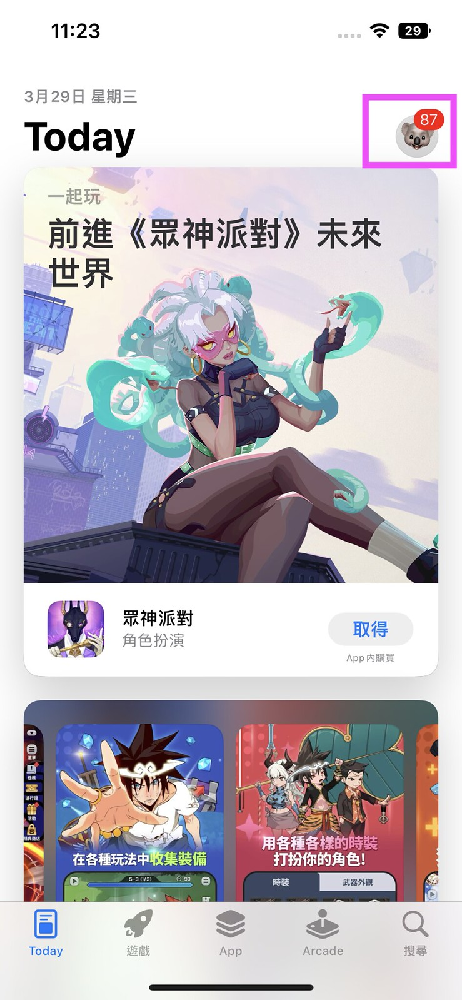
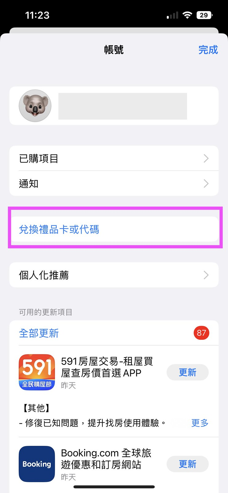
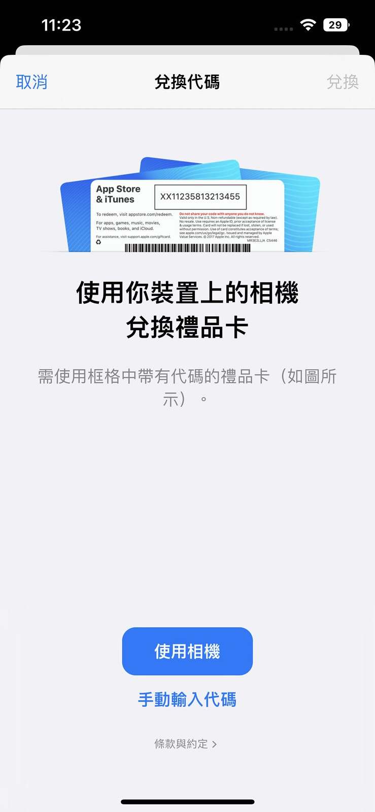

# 没有外国银行卡的情况下给appstore充值下载付费app

## 首先购买礼品卡

礼品卡可以很多地方购买，一般卖美区和港区的比较多，其它地方的比较少

shop.484.me可以购买！

购买礼品兑换码后使用

1，在卡片背面找到 16 位代码。对于某些充值卡，你可能需要撕开或轻轻刮掉标签才能查看代码。

2，在 iPhone、iPad 或 iPod touch 上，打开 App Store App。在屏幕顶部，轻点登录按钮  或你的照片。

3，轻点“兑换充值卡或代码”。如果你没有看到“兑换充值卡或代码”选项，请使用你的 Apple ID 登录。

4，轻点“使用摄像头”，然后按照屏幕上的说明操作。如果你在兑换充值卡时遇到问题，请轻点“Enter Code Manually”（手动输入代码），然后按照屏幕上的说明操作。
轻点“完成”。

按以上步骤可以完成充值！