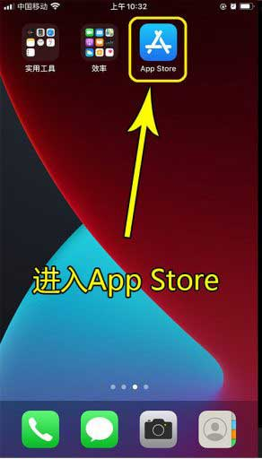
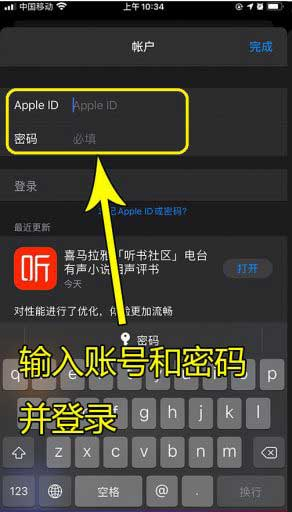
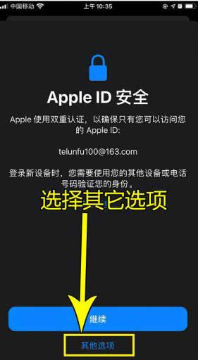
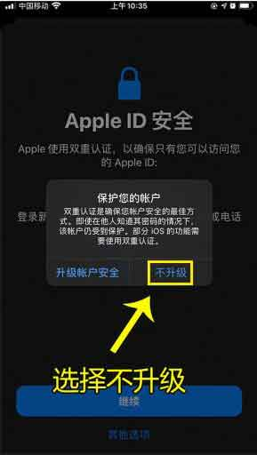

# 如何更换AppStore里的Apple ID

演示机型信息：

　　品牌型号：iPhone13

　　系统版本：iOS 15.5

1、打开iPhone13，找到AppStore应用软件，并点击进入；

2、点击右上角的头像，进入账户设置页面，一直下滑到底部，直到看到“退出登录”；

3、找到退出登录  

4、输入要登录的id。

5、要开启双重认证，一般如果不开启，建议选不升级

6、跳出的  双重认证，共享ID一般不要开启，如果是自己的独立ID建议开启

