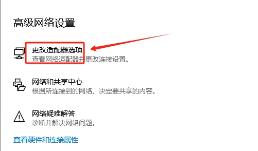

# windowsDNS被劫持怎么办。

dns被劫持
‌DNS劫持是一种网络攻击，攻击者会篡改用户的DNS设置，将域名指向恶意IP地址，导致用户被重定向到假冒或不可达的网站。以下是针对DNS劫持的解决方法：

‌检查并重置DNS设置‌
‌对于电脑‌：

以下为win8,10等的视图
打开“网络和共享中心”，点击已连接的网络名称。 

1，点击右下角的网络图标

2,选择更改适配器选项

3，我们可以看到演示的电脑有两张网卡，一张无线【wifi】,一张有线【网线】，文中以无线为例。点击网卡右键，选属性

4，选属性后  选择tcp/ip ipv4

TCP/IPV4显示

5,修改为权威dns

点击“属性”，选择“Internet版本协议4(TCP/IPv4)”，再点击“属性”。
查看DNS服务器地址，如果显示为手动设置的陌生地址，则可能被篡改。将其改为自动获取，或设置为可靠的DNS服务器地址（如Google的8.8.8.8和8.8.4.4）

除了以上dns还有以这些dns服务器可以使用

其他常用 DNS ：

114 DNS：

114.114.114.114 

114.114.115.115 

腾讯 DNS：（DNSPOD）

IPv4地址：

119.29.29.29

182.254.116.116

IPv6地址：

2402:4e00::

阿里DNS：

IPv4地址：

223.5.5.5

223.6.6.6

IPv6地址：

2400:3200::1

2400:3200:baba::1

百度DNS：

ipv4：180.76.76.76

ipv6：2400:da00::6666

‌对于路由器‌：
登录路由器管理界面（通常为192.168.1.1）。
进入“网络参数”下的“WAN口”设置，查看并重置DNS服务器地址为自动获取或可靠的DNS服务器地址。