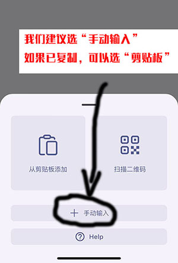
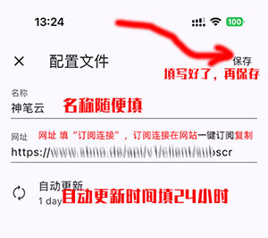
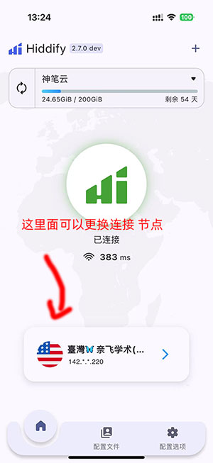

# Hiddyfi 安卓，苹果ios 使用教程

本教程由苹果手机演示编写，安卓手机大同小异，请操作过程中根据自己的情况酌情处理

软件下载 ：

安卓手机请下载1：[https://file.sbno.de/hiddify-app/Hiddify-Android-universal.apk](https://file.sbno.de/hiddify-app/Hiddify-Android-universal.apk)

安卓 下载地址2：https://doc.sbno.de/soft/hiddify/Hiddify-Android-universal.apk

苹果手机请下载：[https://apps.apple.com/us/app/hiddify-proxy-vpn/id6596777532?platform=iphone](https://apps.apple.com/us/app/hiddify-proxy-vpn/id6596777532?platform=iphone)

苹果手机需要注册外区id,注册请参考本站的，外区id注册教程

下载成后请打开软件，开放提示所需要的权限.

1，下载好后打开软件

2,一般选择手动输入，如果已复制，可以直接  剪贴板

3，名称：随便填   网址：填写“订阅连接”，订阅连接在网站“一键订阅”处  复制

4，添加好了  回到主页

5，选择节点   

