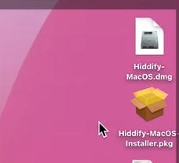
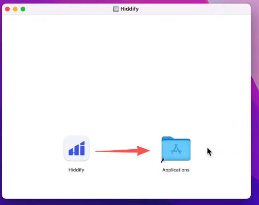
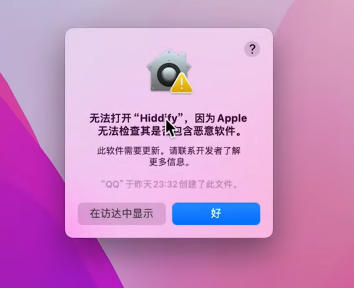
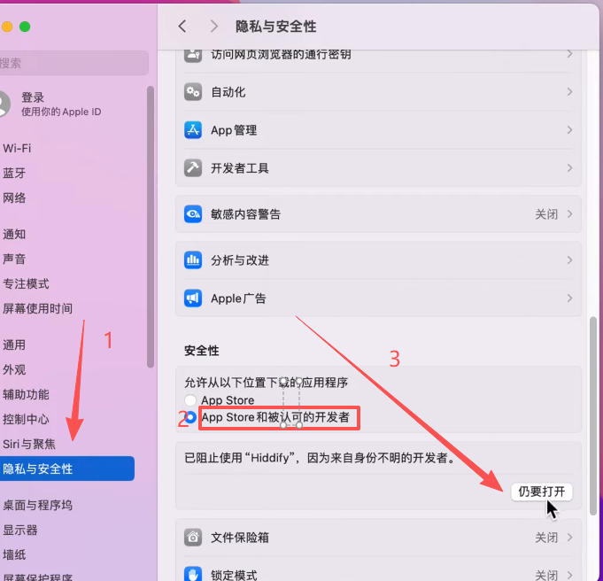
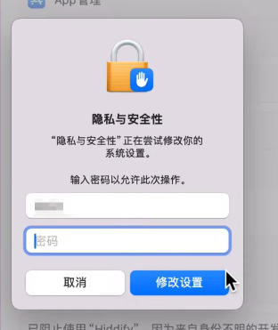
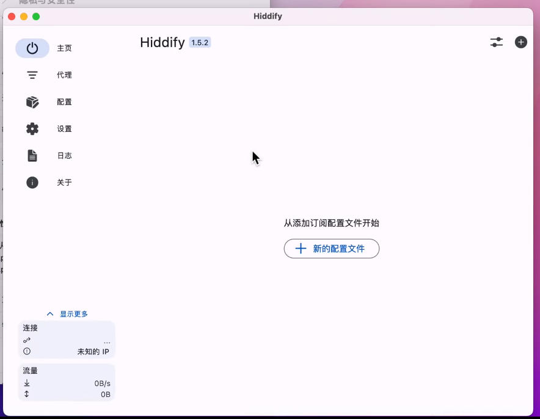
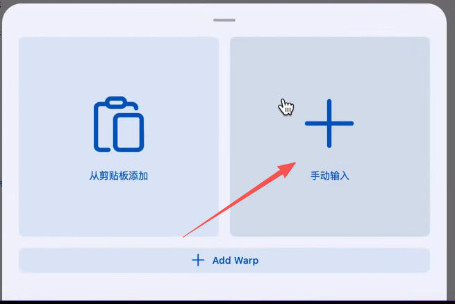
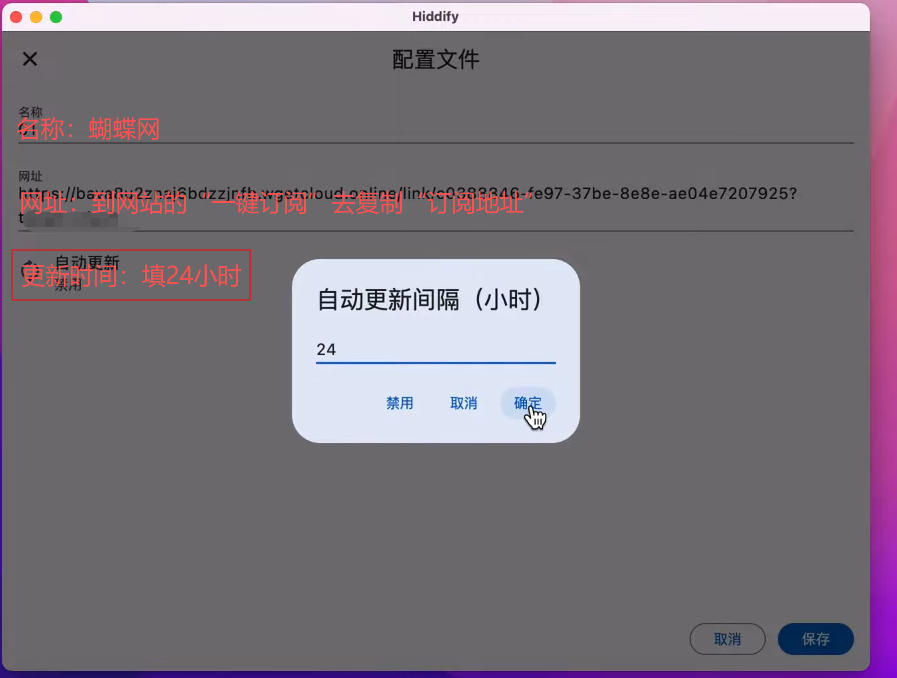
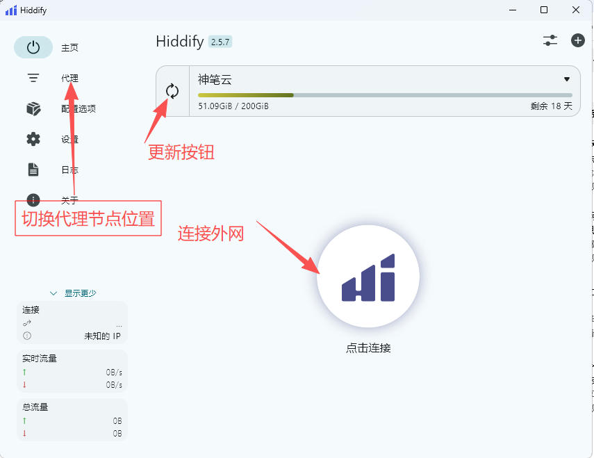

# Hiddify mac 使用教程

### 下载软件

Mac下载1 ：https://doc.sbno.de/soft/hiddify/Hiddify-MacOS.dmg

Mac下载2 https://github.com/hiddify/hiddify-app/releases/latest/download/Hiddify-MacOS.dmg

### 安装：

双击下载的软件

将图标  拖动到  应用程序  Applications

###  软件打开（初次可能遇到打不开的情况处理方法）

显示无法打开  

处理方法：设置----》安全性与隐私-----》安全性----》APPstore和被人可的开发者----》选任要打开

请输入 电脑密码

请选择打开  

###   软件使用

1，选择 “新的配置文件” 

2，选择  手动输入   注意此步骤，也可到网站一键订阅，一键导入功能，演示是为了让大家明白过程 

3 ，按图中所示填写  内容

4，主面版显示内容  订阅没问题，可以选  连接

5，代理页，可以选择相关节点。

