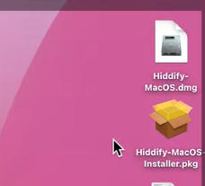
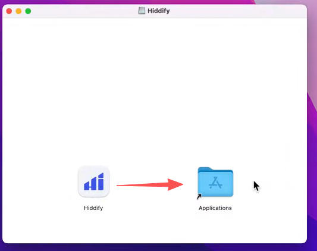
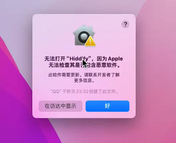
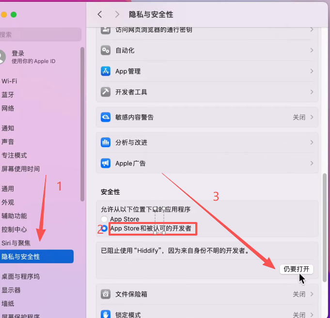
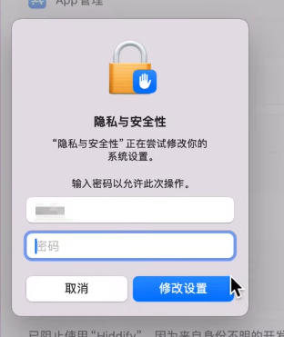
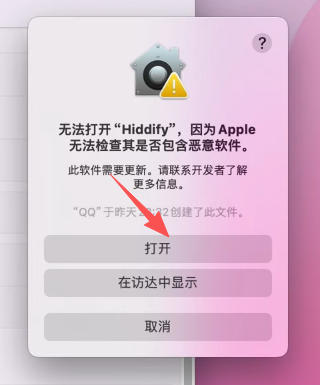
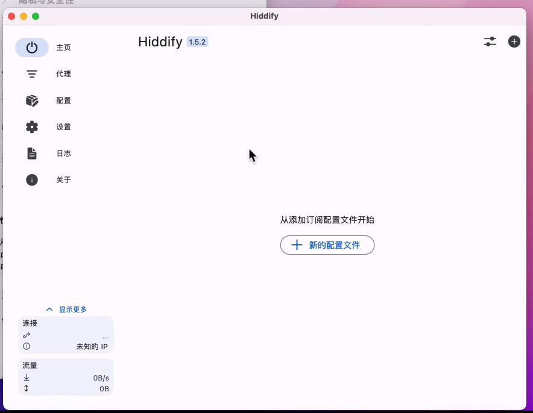
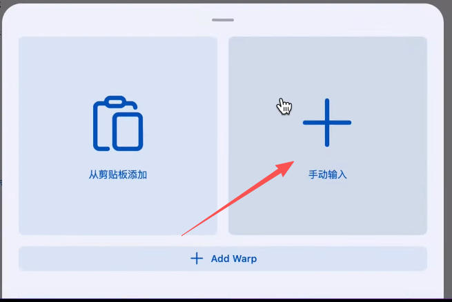
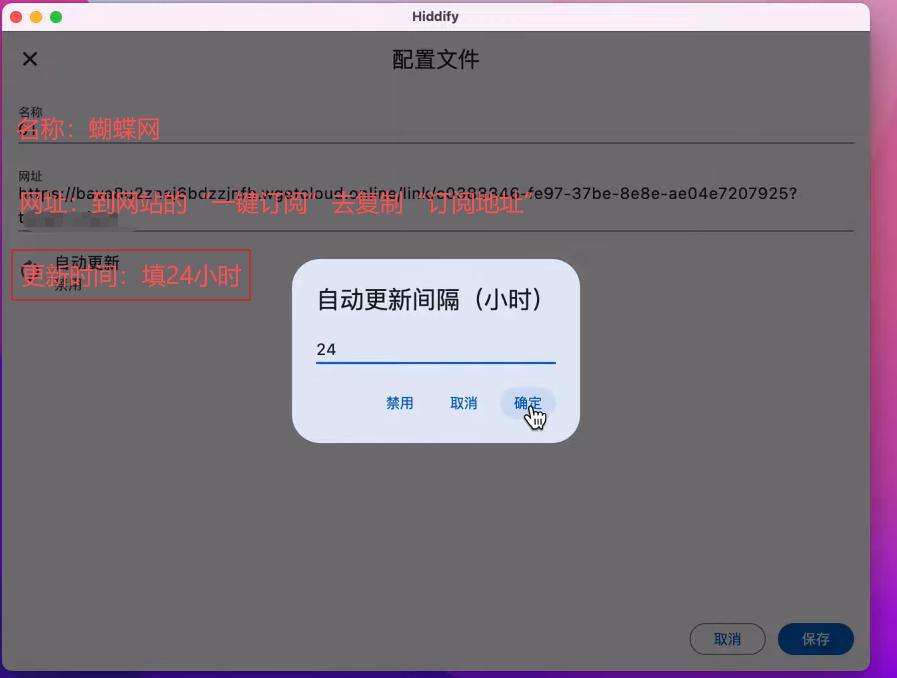
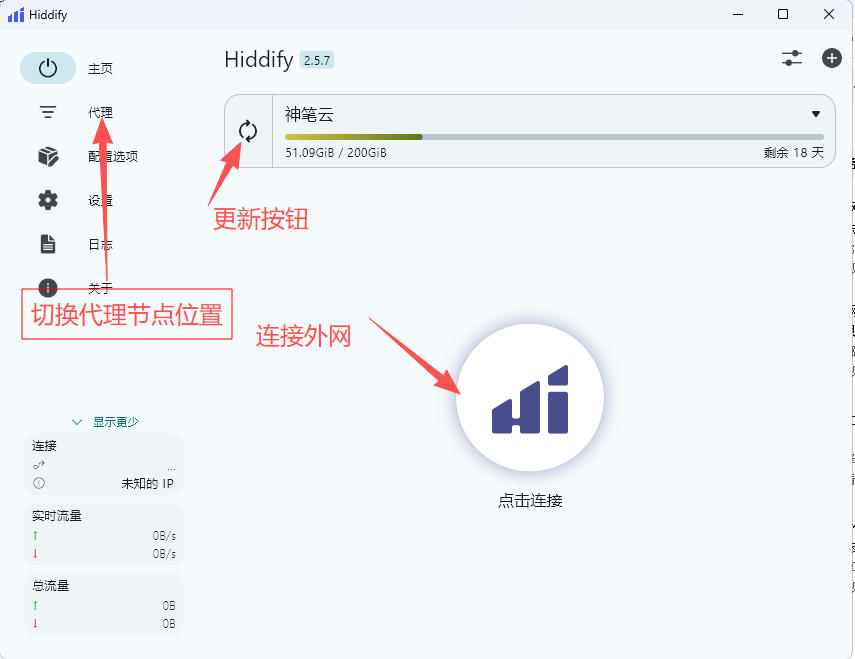

# Hiddify mac 使用教程


### 下载软件

Mac下载1 ：https://doc.sbno.de/soft/hiddify/v4.0.4/Hiddify-MacOS.dmg

Mac下载2 https://github.com/hiddify/hiddify-app/releases/latest/download/Hiddify-MacOS.dmg


### 安装：


双击下载的软件




将图标  拖动到  应用程序  Applications





###  软件打开（初次可能遇到打不开的情况处理方法）


显示无法打开  





处理方法：设置----》安全性与隐私-----》安全性----》APPstore和被人可的开发者----》选任要打开


错误 处理，若提示  文件损坏，按提示在终端运行命令  

sudo xattr -rd com.apple.quarantine /Applications/Hiddify.app





请输入 电脑密码





请选择打开  





###   软件使用


1，选择 “新的配置文件” 





2，选择  手动输入   <font color="red" >注意此步骤，也可到网站一键订阅，一键导入功能，演示是为了让大家明白过程 </font>





3 ，按图中所示填写  内容





4，主面版显示内容  订阅没问题，可以选  连接





5，代理页，可以选择相关节点。


###  错误处理


Mac 系统上安装或打开 Hiddify 时提示“已损坏，打不开。你应该将它移到废纸篓”或者“无法验证开发者”，这其实是 macOS 的安全机制（Gatekeeper）在拦截未在 App Store 上架或没有经过苹果官方签名的第三方软件。

别担心，软件本身没有坏。你可以通过以下几种方法来解决：


方法一：极速解锁（最常用）


这是最简单的方法，直接在系统设置里给它“放行”：

保持提示“已损坏”的弹窗关闭。

打开 Mac 的 系统设置 (System Settings)。

下滑找到并点击 隐私与安全性 (Privacy & Security)。

向下滚动，寻找 “安全性” 这一栏。

你会看到一条提示，大意是 “由于 Hiddify 不是来自可识别的开发者，因此被阻止打开”。

点击旁边的 “仍要打开” (Open Anyway)，然后输入你的 Mac 开机密码确认即可。


方法二：终极命令（如果方法一不奏效）


如果系统设置里没有出现“仍要打开”，或者点击后依然报错，可以通过终端（Terminal）彻底移除这个安全限制：

打开 Mac 的 终端 (Terminal)（可以通过 Command + 空格键 搜索“终端”找到）。

复制并粘贴以下命令（注意：后面有一个空格）：

  ```

sudo xattr -r -d com.apple.quarantine 

  ```


打开你的 访达 (Finder) -> 应用程序 (Applications)，找到 Hiddify 的图标。

将 Hiddify 的图标拖拽到刚才的终端窗口中（它会自动帮你生成软件的路径），此时命令看起来应该像这样：


  ```

   sudo xattr -r -d com.apple.quarantine /Applications/Hiddify.app

  ```

按下回车键 (Enter)，终端会提示输入密码（Password）。

输入你的 Mac 开机密码（注意：输入密码时屏幕上不会显示任何东西，连星号都没有，这是正常的，盲输完直接按回车即可）。

执行完毕后，重新去应用程序里双击打开 Hiddify，就能正常运行了！


