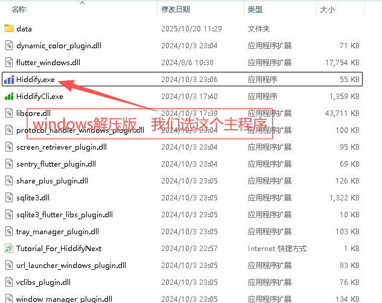
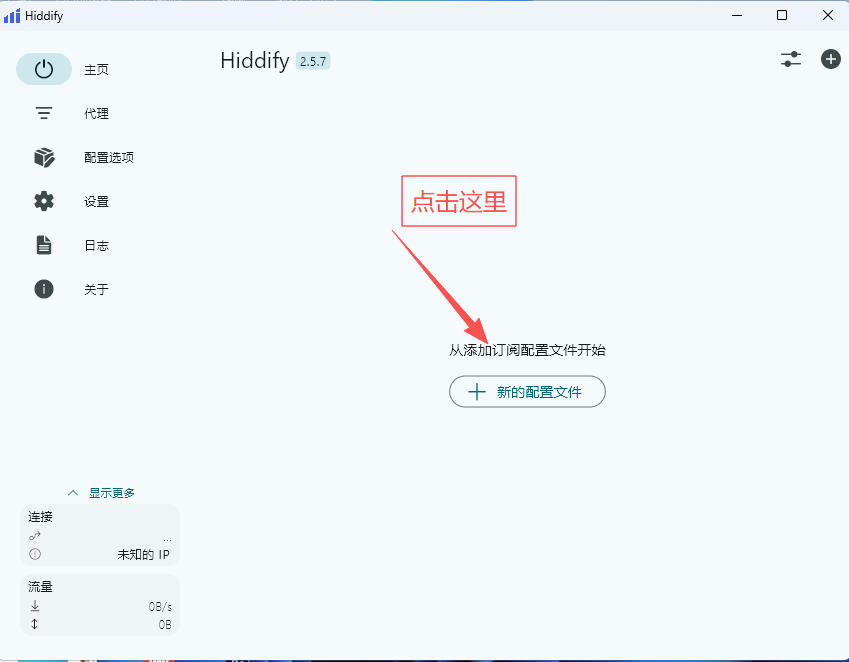
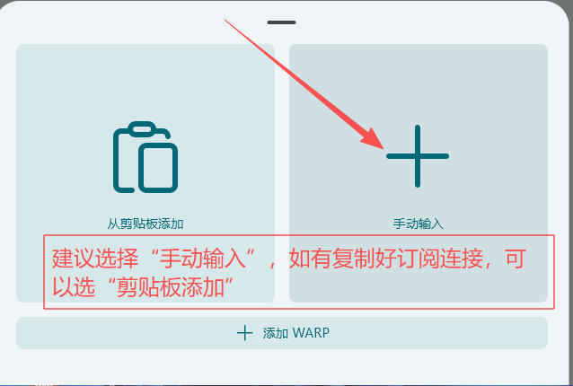
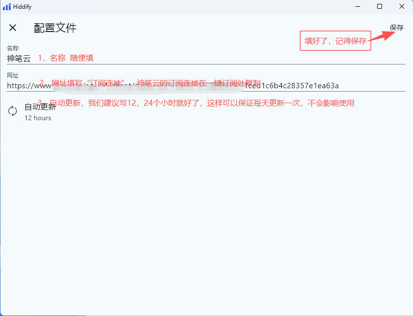
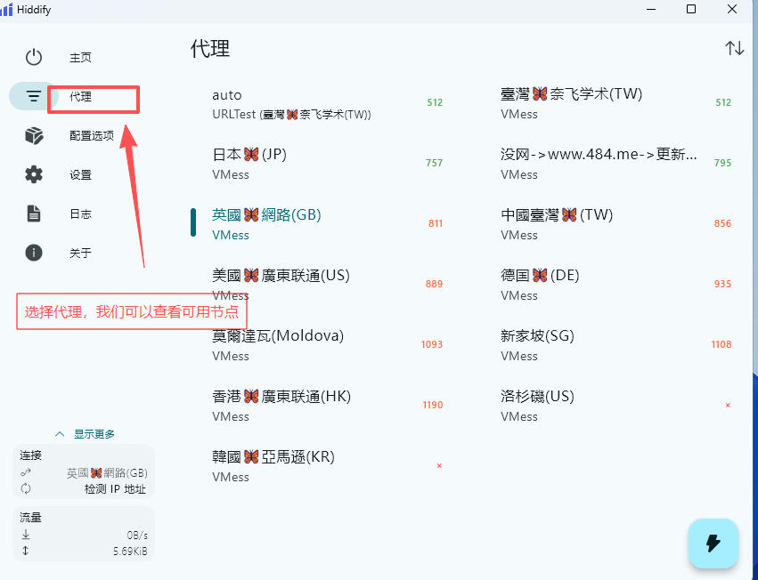

# Hiddify win  linux mac 使用教程

本教程只写windows教程，其它系统提供下载连接，安装过程有差异，请自行完成安装过程

windows下载：[https://doc.sbno.de/soft/hiddify/Hiddify-Windows-Portable-x64.zip](https://doc.sbno.de/soft/hiddify/Hiddify-Windows-Portable-x64.zip)

linux   国产deepin/UOS   ubuntu/debian下载：   https://doc.sbno.de/soft/hiddify/Hiddify-Debian-x64.deb

linux   国产腾讯opencloudos  centos 红帽系下载: https://doc.sbno.de/soft/hiddify/Hiddify-rpm-x64.rpm

Mac下载 ：https://doc.sbno.de/soft/hiddify/Hiddify-MacOS.dmg

windows教程开始：

下载好了，我们建议直接解压到D盘的一个文件夹，不然会到处都是文件

1，第一步，打开主文件.

2，选择添加配置

3，填写配置内容

4，启动代理

5，选择自己合适的节点，供自己使用

