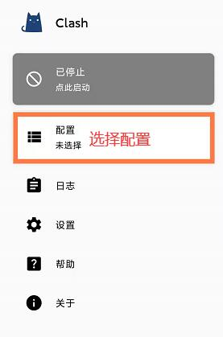
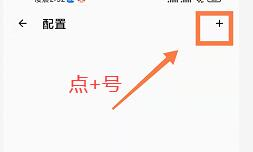
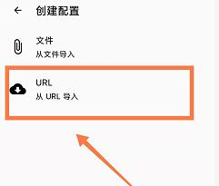
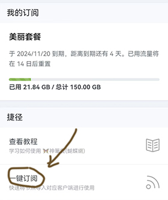
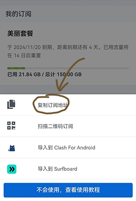
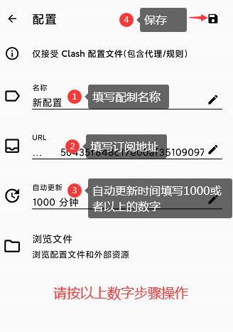
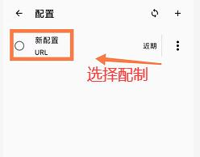
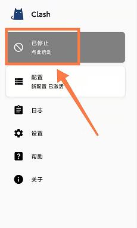
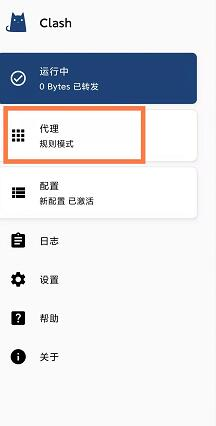
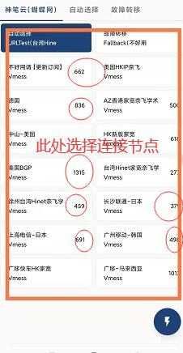

#  clash安卓手机使用方法

软件在国产安卓小米,国产华为mate50 手机亲测通过

**各位祖宗大爷，请从你们手机浏览器打开这个网页下载app.不要从微信qq打开**

**我已经被你们这群人搞蹦了，实在不行就自己退群，骂你们的心情都没有了**

下载安卓clash  

 

连接1**请从浏览器打开下载**

https://file.sbno.de/apk/cfa-2.5.9-foss-universal-release.apk

备用下载 **请从浏览器打开下载**

https://shenbicloud.oss-cn-hongkong.aliyuncs.com/cfa-2.5.9-foss-universal-release.apk

使用步骤

**使用之前，请把你自己的手机时间校对准确，确认手机时间准确再使用，特别是华为手机，时间不准确是常有的事。华为手机订阅不上，请开启小猫定位权限，读写权限，时间同步权限自己百度 安卓手机同步。时间不准确不能使用。。。**

打开软件选择配制

点击加号增加配制

选择URL下载

复制订阅连接

网站仪表盘---->一键订阅复制订阅地址

**填写配制信息【请按数字步骤逐个填写操作】**

配制名称：随意填写

URL:请到网站的【一键订阅】去复制

更新时间：1000

选择刚刚填写的配置内容

返回主页后，点此启动

选择上网节点方法启动后会出现【代理】规则

进去代理规则后，可以选择相应节点上网，有数字的节点表示可以正常上网

