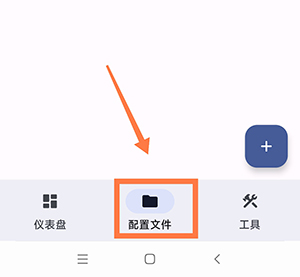
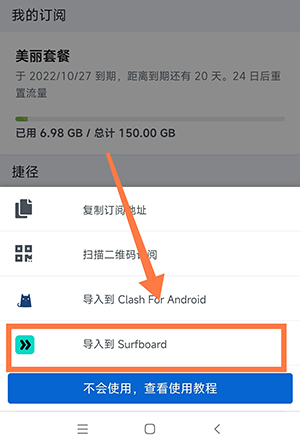
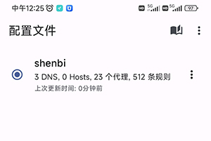
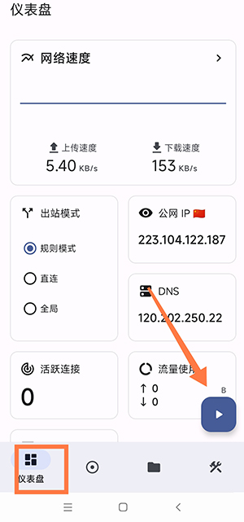

#  surfboard安卓手机使用方法

surfboard 和clash一样。是分流使用软件。

以下简要说明surfboard使用方法
首先要保证手机时间是正确的

软件下载 

http://file.sbno.de/apk/Surfboard_2.22.9.apk

1打开软件选择配制文件。

2 到网站首页找到一键订阅---导入surfboard 

3导入成功之后见图片，若未成功，报错，如果用的手机流量请换成wifi,如果 用的wifi 请换成流量，并重启手机，再试

4导入成功后，回到软件首页-点击播放按钮。弹出---vp权限一定要充许。---出站模式一定要选择规则模式，或者全局

