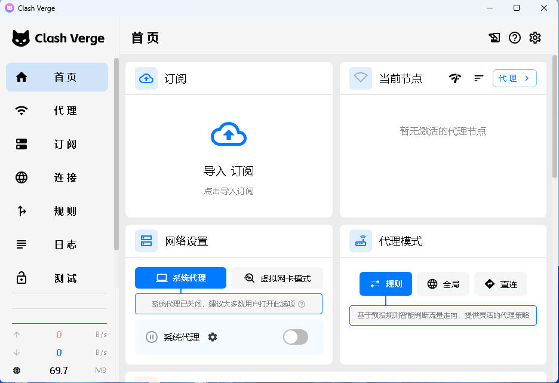
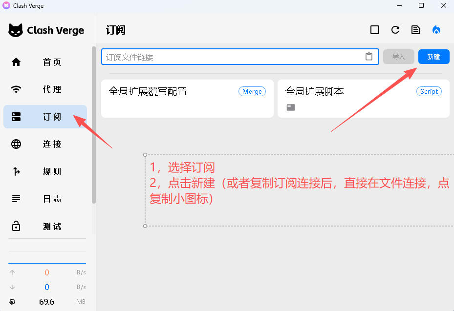
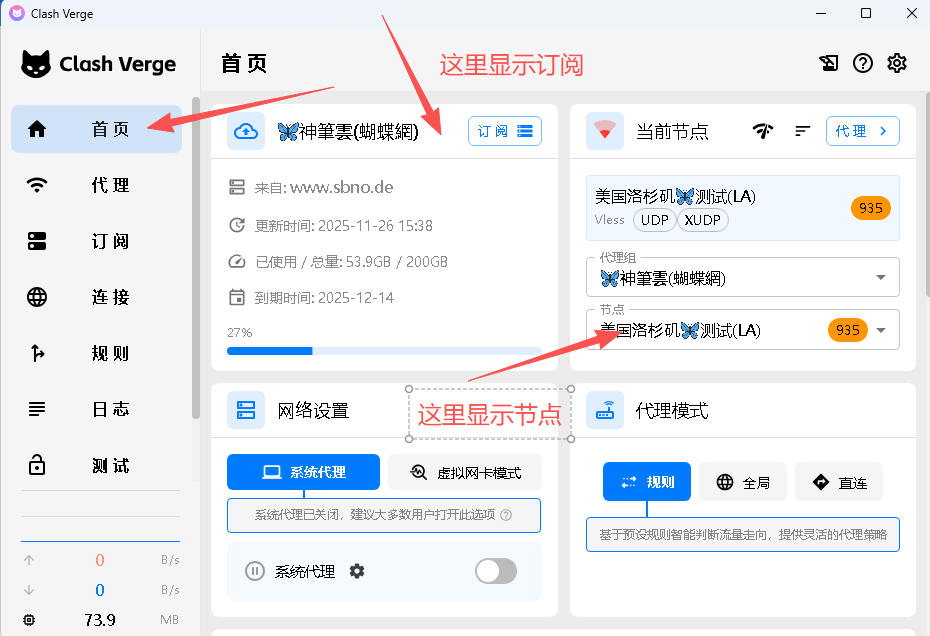
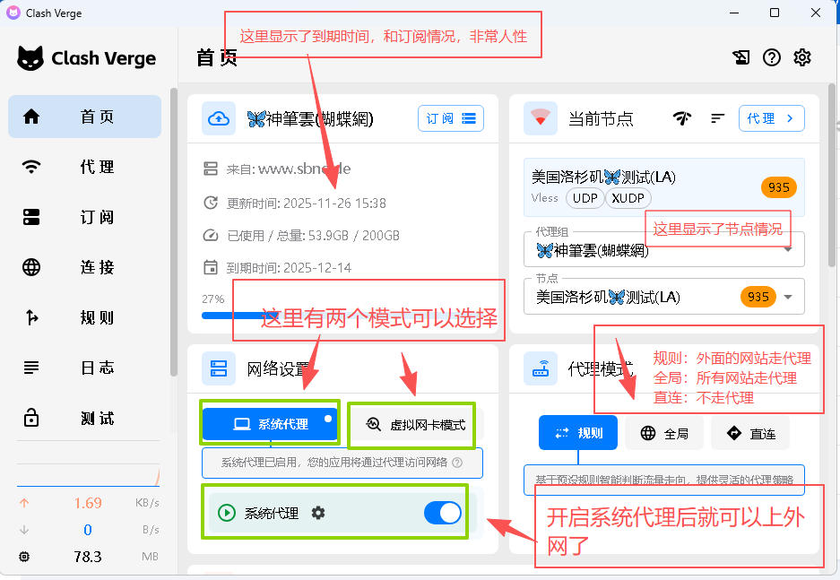

# clash verge 使用教程

cladh verge 目前支持windows64  / windows arm    /macOS intel CPU  /Mac M  CPU / linux debian centos

### 下载

windows64 一般是amd/intel cpu  下载：https://doc.sbno.de/soft/ClashVergeRev/Clash.Verge_2.4.3_x64-setup.exe

macOS intel CPU 下载：https://doc.sbno.de/soft/ClashVergeRev/Clash.Verge_2.4.3_x64.dmg

MacOS M  CPU   下载： https://doc.sbno.de/soft/ClashVergeRev/Clash.Verge_2.4.3_aarch64.dmg

linux 暂时不提供下载连接。

以下以windows 教程为例  本站提供的是 2.4.3版本下载。目前测试可用。

1，下载安装好后，会显示相关的信息

2,连接【订阅】----去填写订阅情况，我们可以从网站找到【一键订阅】复制订阅地址，也可以在一键订阅【一键导入】

3，如果我们选择【新建】---刚按图中所示，填写

4，如果我们订阅成功，我们回到软件【主页】

5，回到【主页】，我们看到如下界面。我们把【系统代理】打开。请认真看图片中的知识点

