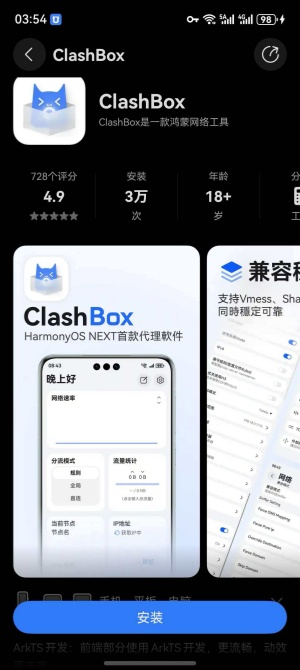
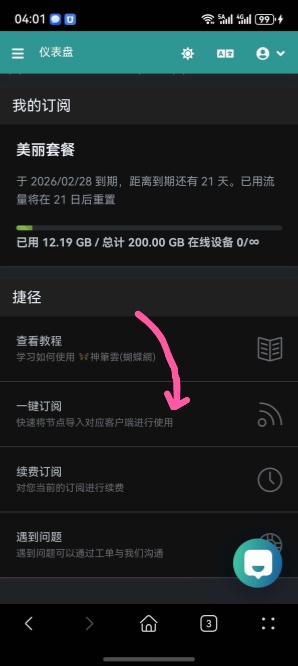
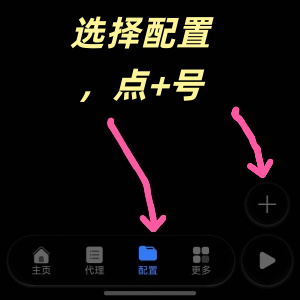
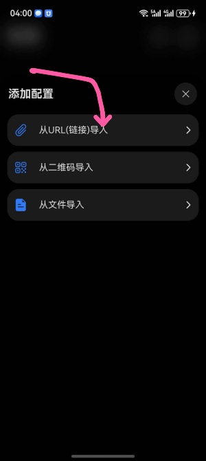
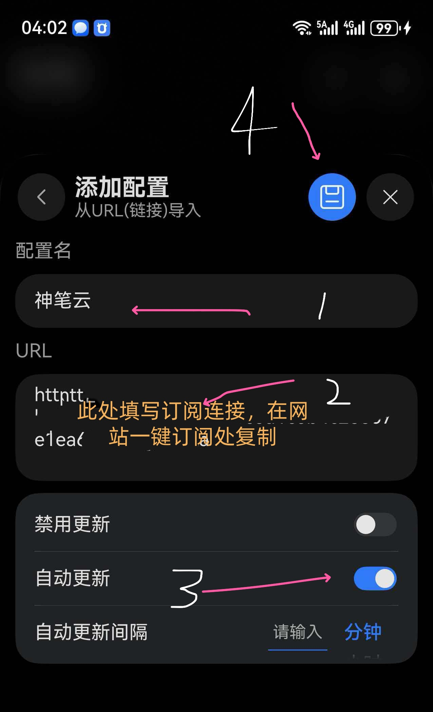
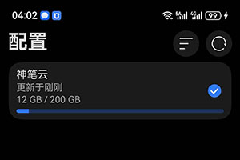
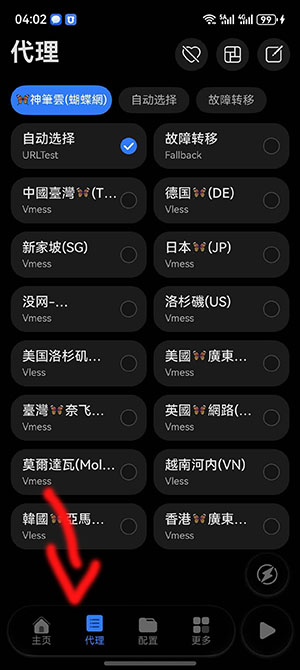
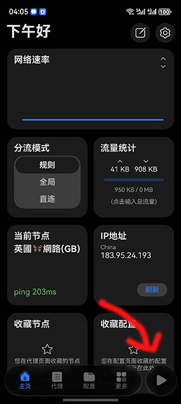

# 华为鸿蒙 5和6教程

###  使用须知  本人在 pura 80手机  测试  有一些Bug 未修复

注册华为香港区账号

注册网址 [https://id5.cloud.huawei.com/AMW/portal/home.html](https://id5.cloud.huawei.com/AMW/portal/home.html)

注册完账号后 从设置里退出你的账号，登录新账号。。下载 clashbox

下载好软件如图所示

先从网站  一键订阅复制订阅连接

打开软件，选择配置   点   +  号

选择   从URL  导入

 按图中所示填写

 

 订阅好了 如图所示

 

 稍等一会，点代理  可看到节点信息

 

回到首页 点播放

 

