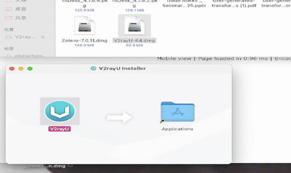
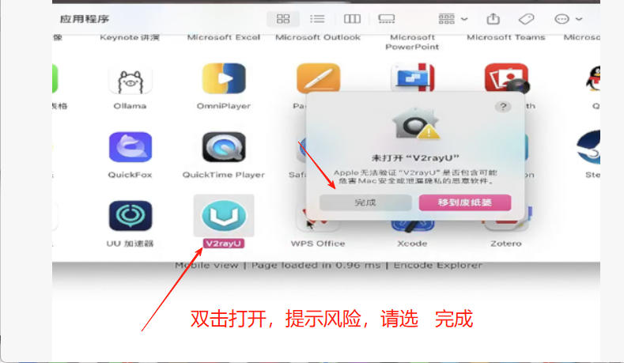
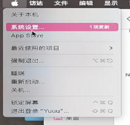
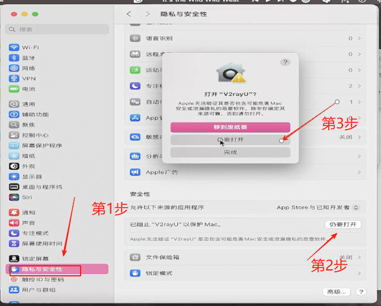
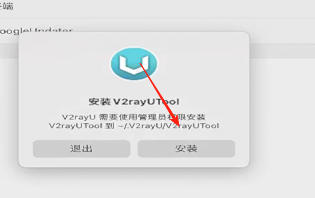
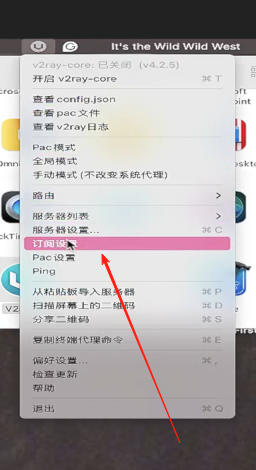
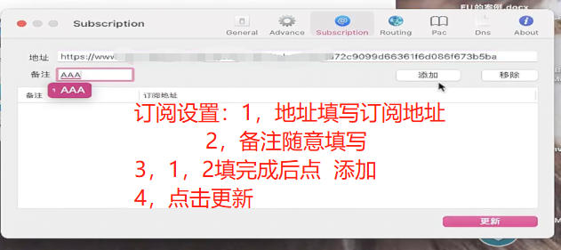
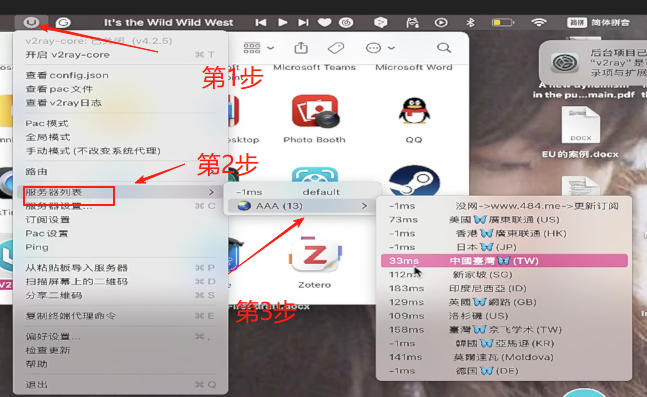
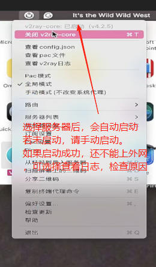

# mac V2rayU工具使用方法

V2RayU下载地址

目前V2RayU用户量少，作者更新少，工具比放弃更新的小猫好用。下载自己适合的版本。具体哪个，根据自己电脑的CPU来决定。电脑CPU查看方法，关于本机

intel CPU 芯片请下载  

https://file.sbno.de/mac/V2rayU-64.dmg

ARM  CPU请下载   

https://file.sbno.de/mac/V2rayU-arm64.dmg

千万别下载 错了，下载错了也能打开，但不能使用

使用前请认真核对电脑时间，清理以前使用过的外网软件，浏览器插件
认真阅读教程和使用前须知
如果所以软件mac系统都没法使用，请联系，帮您远程操作20￥包搞定服务

**复杂的问题简单办，MAC用户提付费远程。
提供 20￥每次的远程服务，包搞定，搞不定不收钱。**

# 第一步  安装

把下载的安装包打开，把软件拖到应用程序

我们到应用程序打开，会显示风险，请选择  完成  。

解除风险提示  系统设置----安全性与隐私-----安全性------任要打开

提示要安装辅助功具，请按提示   安装

# 第二步 使用

安装完成后会在顶步显示小图标

订阅设置   此步骤比较繁琐，请认真看图

选择服务器

开启核心core,完成以上步骤，基本就可以用了

 

# 错误检查   安装成以上步骤  基本可以使用，如果不能使用可以查看  V2ray日志来排查错误 

