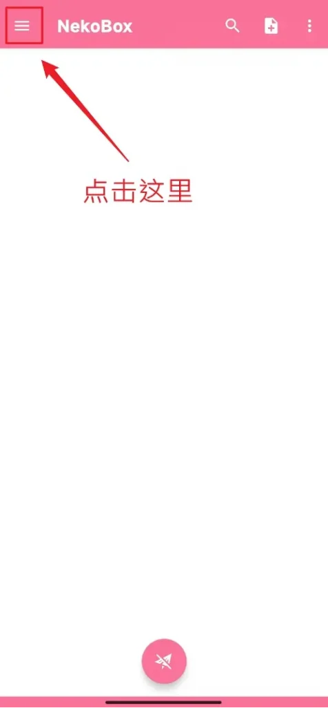
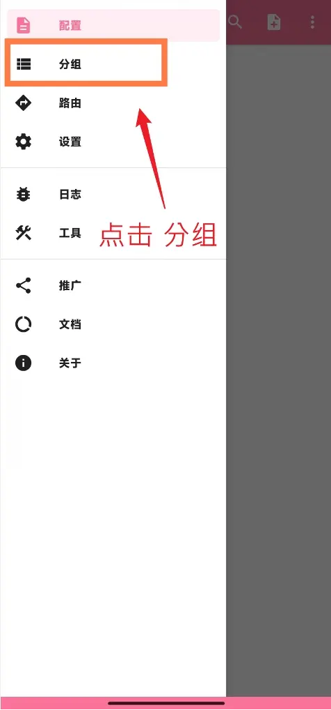
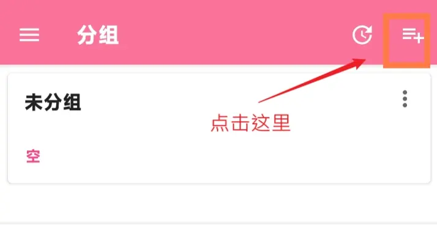
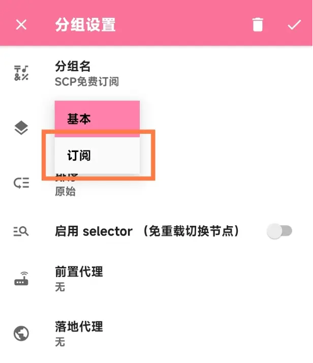
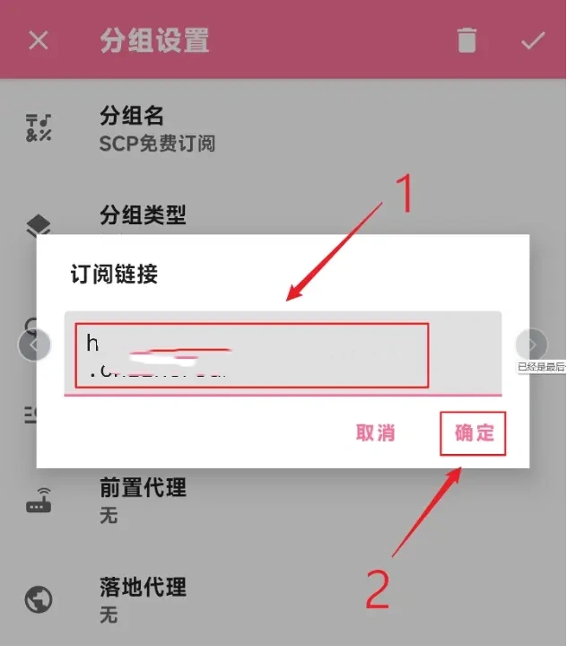
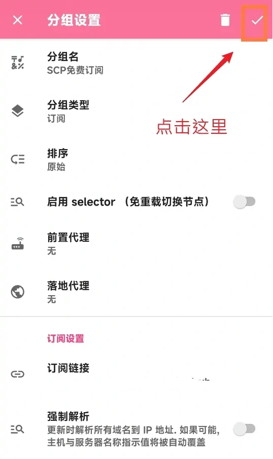
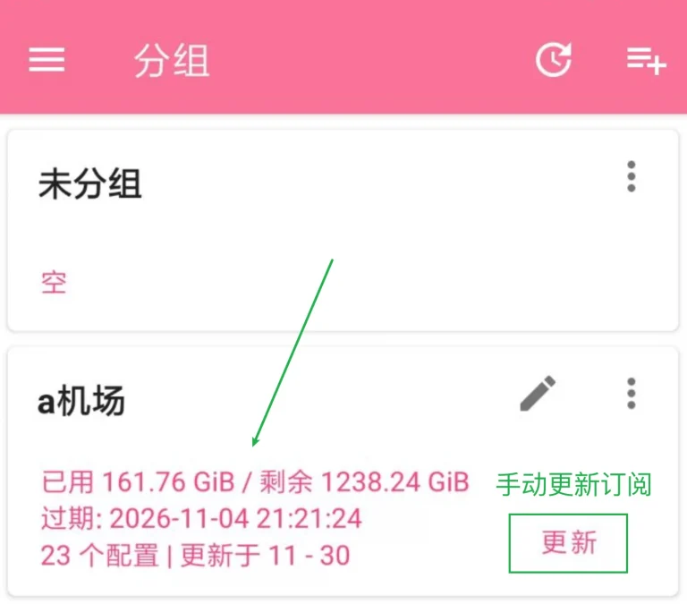
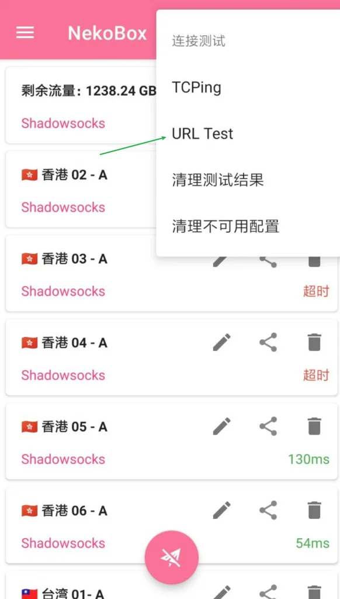
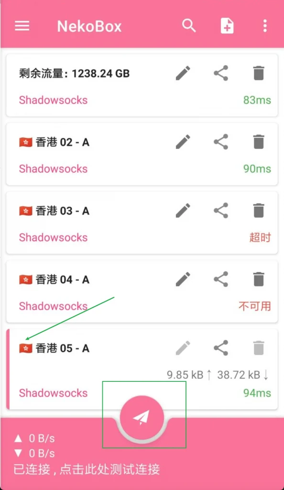
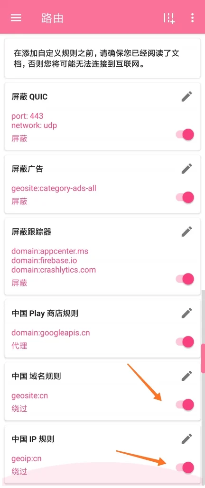

#  Nekobox 安卓版教程

NekoBox添加订阅
启动后打开左上角菜单，选择分组

点击右上角，添加新分组

填写对应的信息，分组名称，分组类型，这里以订阅为例

填入从代理服务商那里获取到的订阅链接   订阅连接  在网站【一键订阅】---【订阅地址】 处复制

最后点击右上角确认，完成配置

成功后主页中会显示刚刚添加的节点，可以点击更新按钮来更新订阅

点击右上角菜单，选择“连接测试”，再点击 “URL Test” 进行节点测试

测试完成后，选择合适的节点，点击下方飞机按钮启用节点

默认情况下是全局代理，但推荐设置国内网站直连

所以可以选择打开中国域名规则以及中国IP规则

