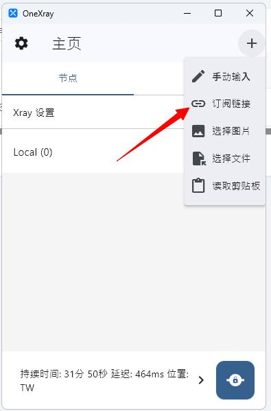
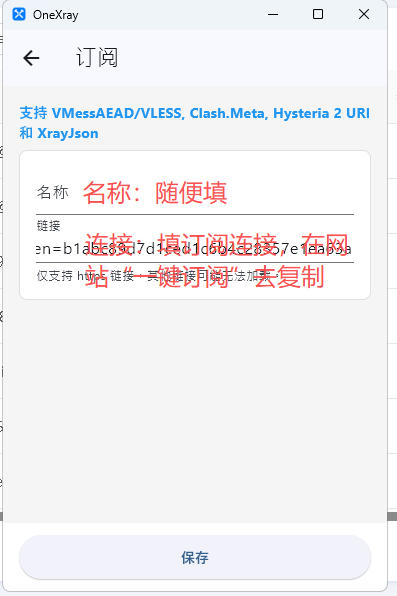
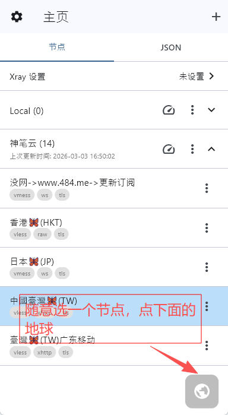

#  OneXray 电脑版教程

电脑版 Onexray 支持 Windows 10, Windows 11(win7,win8不支持)，macOS 12.0 and above	，linux GLIBC >= 2.39	

下载地址  windows X64  : https://doc.sbno.de/onexray/OneXray-windows-amd64.zip

macOS ： https://apps.apple.com/us/app/onexray/id6745748773

linux :暂时不公布地址，需要的联系

使用教程用windows演示 使用的是绿色版，下载后解压到  D盘，任意位置，打开后有一路确定设置，请自行一路确定。。。
 360软件有阻止，请退出后操作，或者添加到白名单中使用

1，打开后，选择  +  号，点“订阅连接”

2, 名称：随便填写    订阅连接：到网站的“一键订阅” 去复制，粘贴过来，然后点确定

3，订阅成功后，主页会显示一些  节点， 随便选一个  节点  然后点右下确的  “ 地球    ”   连接成功后，会显示状态，然后就可以科学  上网了，更多功能，请自行摸索

