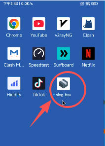
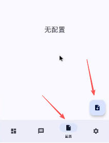
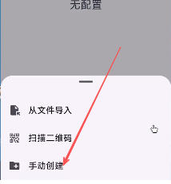
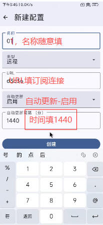

# sing-box i 安卓，苹果ios 使用教程

sing-box 目前支持  安卓  苹果 两个系统，

以下操作以安卓手机为例，安卓系统界面有所不同，但大同小异，请大家自行斟酌

[安卓下载网址](https://file.sbno.de/singbox/SFA-1.13.0-alpha.27-foss-universal.apk)

选择安卓程序

选择【配置】页，点击【新建配置】

选择手动输入

配置页，按图中显示，填写

配置填写完成后，会显示 选择添加的配置，回到主页 仪表盘

启用代理 后，会显示，仪表盘，【概述】和【组】

概述面版简介

组面版  简价，这里可以自己选节点

