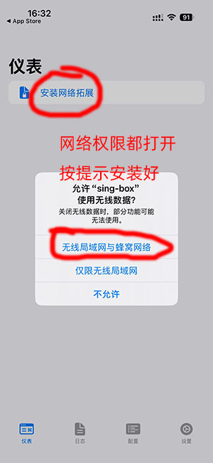
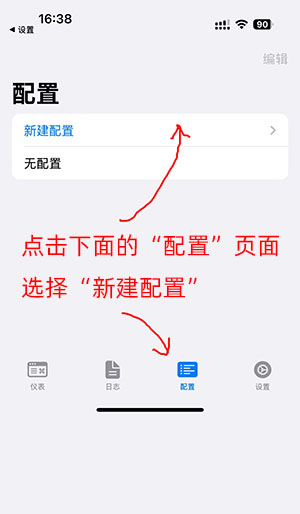
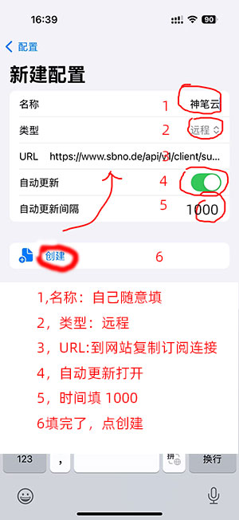
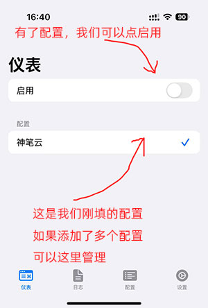
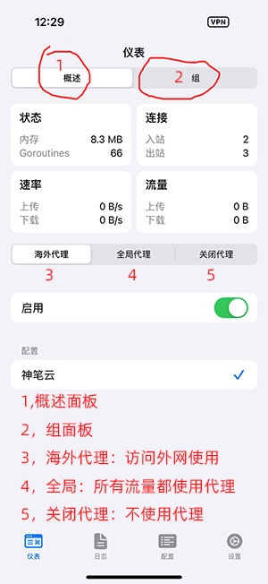
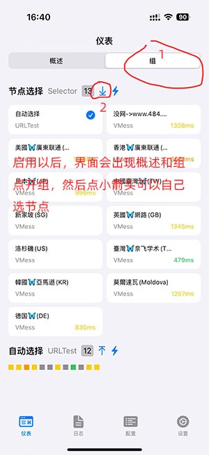

# sing-box i 安卓，苹果ios 使用教程

sing-box 目前支持  安卓  苹果 两个系统，

以下操作以苹果手机为例，安卓系统界面有所不同，但大同小异，请大家自行斟酌

[苹果下载网址 ](https://apps.apple.com/us/app/sing-box-vt/id6673731168)

[安卓下载网址]()

打开时，请允许，无线网络和蜂窝数据，这样才能使用外网

选择【配置】页，点击【新建配置】

配置页，按图中显示，填写

配置填写完成后，会显示 选择添加的配置，点击【启用】 配置

启用代理 后，会显示，仪表盘，【概述】和【组】

概述面版简介

组面版  简价

