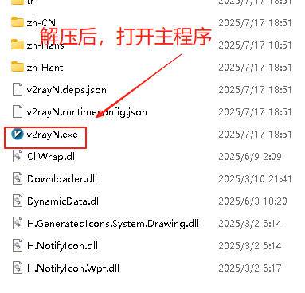
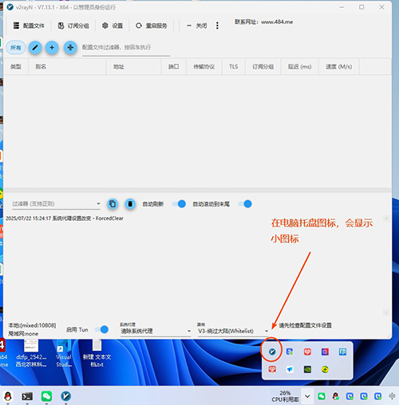
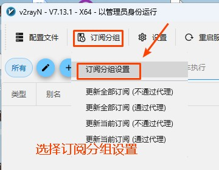
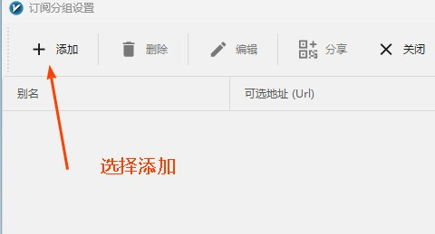
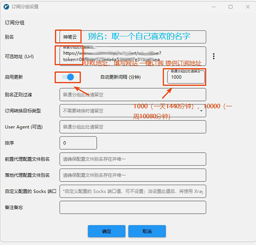
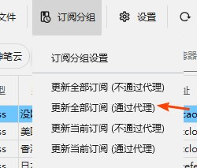
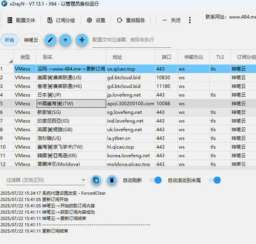
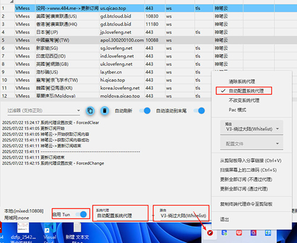
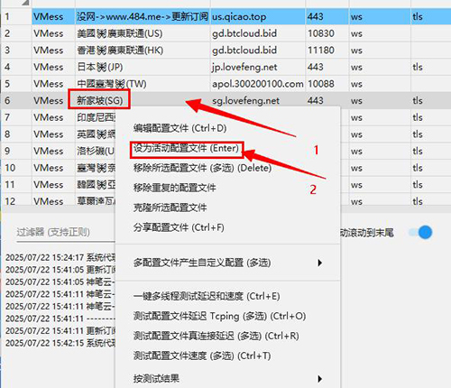

本教程经本人在windows11系统上测试通过，软件是通过vs重新编译打包，只测试了本站的节点，正常使用通过，如遇到问题请反馈。

1，时间校正，电脑时间和正确时间相差不对超过30秒，如果电脑时间不正确，请开启时间同步，时间同步方法，请百度。

2，360等杀毒软件，请自行关闭后使用，如果要留用，请自己放行后使用。不会操作，请直接卸载！

3，下载的文件解压到一个文件夹，必须**解压**，建议解压到D:只有一个盘的，建议在桌面建议一个文件夹，注意**目录不要用中文**，解压到里面，选择如图所选的文件，右键-----》管理员身份运行

软件下载  

本站备份

https://file.sbno.de/win/net8.0-windows10.0.17763.zip

阿里云备份   

https://shenbicloud.oss-cn-hongkong.aliyuncs.com/net8.0-windows10.0.17763.zip

###  1,打开软件，解压后，打开主程序

###  2,打开软件后，可看到主程序界面和托盘图标里有小图标

###  3 选择订阅分组--->订阅分组设置

###  4 选择订阅分组--->订阅分组设置---->添加

###  5 添加订阅，是订阅神笔云节点的步骤

别名：取一个自己喜欢的名字，可以是英文，也可以是中文

**URL地址：要填写神笔云  网站一键订阅处复制订阅地址**

自动更新，根据自己的情况来设置，一般建议打开，自动更新时间，一般建议填写1000，或者10000    ，1000代表一天一更新，10000是一周一更新。

### 6 添加订阅后，有的是自动更新的，有的是没有更新，我们这里首次选择 ** 不通过代理**更新，可以上外网了的时，我们可以选择**通过代理**

### 7 更新成功后，我们会看到订阅的节点，如果没有更新成功，就看不到，此时，我们应该检查原因，可能是订阅连接问题，也可能是网络被限制，也可能是其它原因

### 8 更新成功后，我们可以继续操作，如果上一步，没成功，不能继续操作

一般我们选择**自动配置系统代理**，

TUN我们选择打开，也可以选择不打开。TUN表示，会在我们电脑成生一个虚拟网卡，通过网卡上网，可以在打游戏，或者其它场景中使用，**一般情况下，我们不建议打开。**    不能理解基中原理的，我们一律不打开，避免使用中出现其它情况

路由：我们选绕过大陆即可

### 9 最关键一步，必须学会并理解。此步骤为选择上网节点，图中为使用 新家坡节点，我们在新家坡**点右键**  然后选择----->设为活动节点  即可 【此处也可以选定后，键盘回车键，注意不是双击】  

