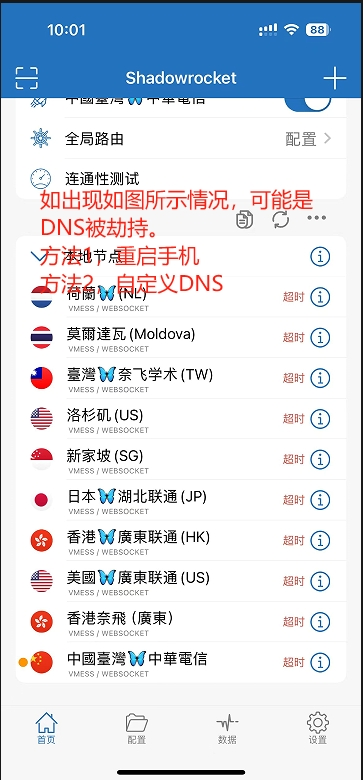
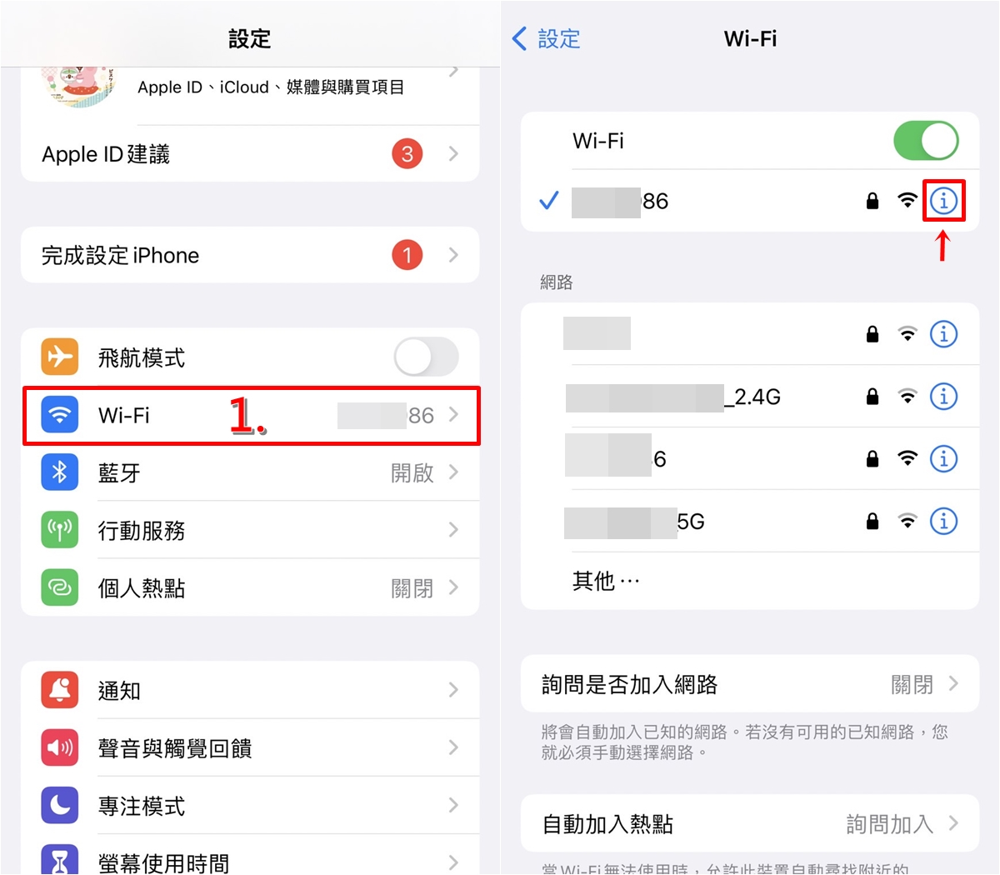
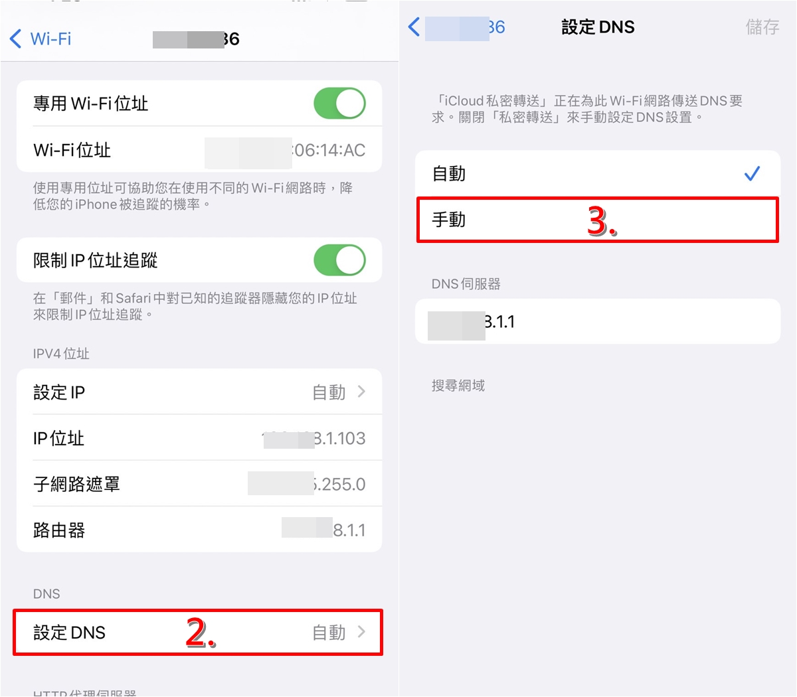
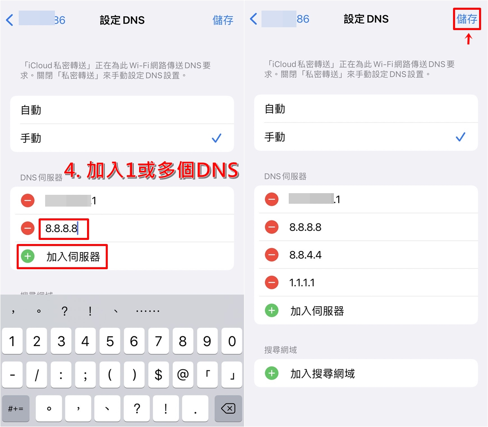

# IOS苹果手机DNS被劫持怎么办。

dns被劫持
‌DNS劫持是一种网络攻击，攻击者会篡改用户的DNS设置，将域名指向恶意IP地址，导致用户被重定向到假冒或不可达的网站。
苹果手机DNS被劫持多半是发生在您连接的WIFI路由器上，使用了路由器做为DNS服务器，这种情况可以使用自定义DNS来解决。
针对WIFI路由器DNS劫持，我们的处理方法。

以下是针对DNS劫持的解决方法：

‌

开启iOS「设置」

点选「Wi-Fi」选项后，选择目前正连上的WIFI

iOS 11以上需点选「设定DNS」，如果是iOS 10用户直接点DNS即可修改

改为「手动」，透过「加入服务器」来新增加「114.114.114.114」

最后点击右上角「储存」按钮

开始使用114DNS

其他常用 DNS ：

114 DNS：

114.114.114.114 

114.114.115.115 

腾讯 DNS：（DNSPOD）

IPv4地址：

119.29.29.29

182.254.116.116

IPv6地址：

2402:4e00::

阿里DNS：

IPv4地址：

223.5.5.5

223.6.6.6

IPv6地址：

2400:3200::1

2400:3200:baba::1

百度DNS：

ipv4：180.76.76.76

ipv6：2400:da00::6666

‌对于路由器‌：
登录路由器管理界面（通常为192.168.1.1）。
进入“网络参数”下的“WAN口”设置，查看并重置DNS服务器地址为自动获取或可靠的DNS服务器地址。